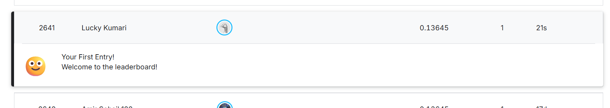

# 🏠 House Price Prediction — Ames Housing Dataset (Kaggle)

This project is based on Kaggle's well-known **"House Prices - Advanced Regression Techniques"** competition. The goal is to predict the `SalePrice` of houses in Ames, Iowa, based on various features (area, quality, year built, etc.).

## 📋 Project Overview

This project implements an end-to-end ML pipeline:

1. **Data Loading** — Load `train.csv` and `test.csv`
2. **Exploratory Data Analysis (EDA)** — Analyze SalePrice distribution, correlation heatmap, and feature relationships
3. **Data Cleaning & Feature Engineering** — Handle missing values, remove outliers, encode categorical features
4. **Model Training** — Train multiple regression models
5. **Model Evaluation** — Compare models using MAE, RMSE, and R² Score
6. **Feature Importance** — Visualize the top features of the best model
7. **Submission Generation** — Generate the final `submission.csv`

## 📂 Project Structure

```
House-Price-Prediction-Kaggle/
│
├── data/                          # Place train.csv and test.csv here
├── images/                        # EDA and feature importance plots
├── House_Price_Prediction.ipynb   # Main notebook (full pipeline)
├── requirements.txt                # Python dependencies
└── README.md
```

## 📊 Dataset

- **Source:** [Kaggle - House Prices: Advanced Regression Techniques](https://www.kaggle.com/c/house-prices-advanced-regression-techniques)
- **Train set:** 1460 rows × 81 columns
- **Test set:** 1459 rows × 80 columns
- **Target variable:** `SalePrice`

The dataset contains 79 explanatory features describing almost every aspect of a residential home — lot area, quality, condition, year built, garage, basement, etc.

## 🔍 Key EDA Insights

- Average `SalePrice` is ~$180,921 (range: $34,900 – $755,000)
- Features most correlated with `SalePrice`:
  - `OverallQual` (0.79)
  - `GrLivArea` (0.71)
  - `GarageCars` (0.64)
  - `GarageArea` (0.62)
  - `TotalBsmtSF` (0.61)
- A few extreme outliers (`GrLivArea` > 4000 sq ft with low price) were removed from the dataset

## 🛠️ Feature Engineering

- Removed extreme outliers (large area, low price cases)
- Log-transformed the target variable (`SalePrice`) using `log1p` to reduce skewness
- Encoded categorical features
- Final feature matrix: **1458 rows × 270 columns**

## 🤖 Models Used

| Model | Description |
|---|---|
| Linear Regression | Baseline model |
| Ridge Regression | Regularized linear model (alpha=10) |
| Random Forest Regressor | 300 trees, max_depth=15 |
| Gradient Boosting Regressor | 300 estimators, learning_rate=0.05 |

All models were trained on scaled features (`StandardScaler`) using an 80-20 train-validation split.

## 📈 Results (Validation Set)

| Model | MAE | RMSE | R² Score |
|---|---|---|---|
| **Gradient Boosting** ⭐ | 14,236.33 | 20,187.36 | **0.9262** |
| Ridge Regression | 15,252.75 | 21,585.09 | 0.9157 |
| Linear Regression | 15,512.72 | 21,877.59 | 0.9134 |
| Random Forest | 16,744.90 | 24,023.33 | 0.8955 |

**Best Model: Gradient Boosting Regressor** — lowest error and highest R² score among all models tested.

## 🏆 Kaggle Leaderboard Score

| Metric | Score |
|---|---|
| **RMSLE (Public Leaderboard)** | **0.13645** |



## 🚀 How to Run

1. Clone the repository:
```bash
git clone https://github.com/luckylucky110507/House-Price-Prediction-Kaggle.git
cd House-Price-Prediction-Kaggle
```

2. Install dependencies:
```bash
pip install -r requirements.txt
```

3. Download `train.csv` and `test.csv` from the Kaggle competition page and place them in the `data/` folder

4. Run the Jupyter notebook:
```bash
jupyter notebook House_Price_Prediction.ipynb
```

## 📦 Requirements

```
numpy>=1.24.0
pandas>=2.0.0
matplotlib>=3.7.0
seaborn>=0.12.0
scikit-learn>=1.3.0
```

## 📤 Output

Running the notebook generates the following files:
- `submission.csv` — Predicted `SalePrice` values in Kaggle submission format
- `price_distribution.png` — SalePrice distribution plot
- `correlation_heatmap.png` — Feature correlation heatmap
- `area_vs_price.png` — Living area vs price scatter plot
- `feature_importance.png` — Top 15 important features of the best model

## 👤 Author

**luckylucky110507**

## 📄 License

This project is for educational and portfolio purposes, based on Kaggle's public "House Prices - Advanced Regression Techniques" dataset.
